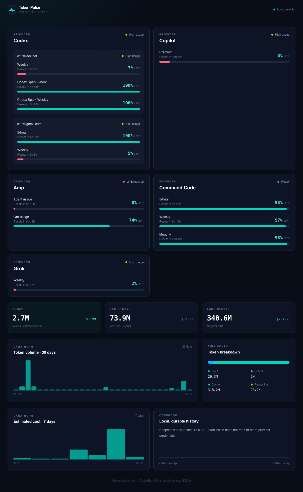

# Token Pulse 👋

<p align="center">
  
</p>

[](https://github.com/jellydn/token-pulse/blob/main/LICENSE)
[](https://github.com/jellydn/token-pulse/stargazers)

A local-first token usage dashboard for [CodexBar](https://github.com/steipete/CodexBar). One Bun server, server-rendered UI, no frontend build runtime.

<p align="center">
  
</p>

## Introduction

Token Pulse reads CodexBar output and turns it into a dashboard you can glance at: provider status, session/weekly limits with reset countdowns, token usage and estimated cost across today / 7-day / 30-day windows and daily burn charts. History is stored durably in local SQLite, so your usage trends survive restarts.

## Features

- 📊 Provider status, session/weekly limits, remaining percentage, and reset countdowns
- 📈 Today, 7-day, and 30-day tokens and estimated cost with prior-period comparison
- 💳 Configurable monthly subscription list and total cost
- 🧩 Input, output, cache, and reasoning-token breakdowns
- 🔥 Daily token and cost burn charts
- 💾 Durable local snapshots and normalized daily history in SQLite
- 🔄 Five-minute collection by default with HTMX dashboard refresh every 60 seconds
- 📱 Responsive phone and desktop layouts, plus useful empty and degraded states
- 📖 High-contrast Kindle/e-ink view with lightweight 10-minute partial refreshes
- 📟 Compact `/api/display` JSON plus an ESP32 e-paper client sketch for always-on desk displays

## Tech Stack

| Technology                               | Purpose                                                    |
| ---------------------------------------- | ---------------------------------------------------------- |
| [Bun](https://bun.sh/)                   | Runtime, server, and SQLite driver                         |
| [Hono](https://hono.dev/)                | HTTP routing and JSX server rendering                      |
| [HTMX](https://htmx.org/)                | Dashboard auto-refresh without a client bundle |
| [Tailwind CSS](https://tailwindcss.com/) | Styling (compiled to one static CSS file)                  |
| SQLite (WAL mode)                        | Durable snapshots and daily history                        |

## Prerequisites

- [Bun](https://bun.sh/) 1.2 or newer

## Quick Start

```sh
bun install
cp .env.example .env
bun run build
bun run start
```

Configure `TOKEN_PULSE_SOURCE=http` (default) or `cli`, then open `http://127.0.0.1:3000`.

For development, run `bun run build:css` once and then `bun run dev`. Re-run the CSS build after changing Tailwind classes or the stylesheet — the hot-reload dev server does not rebuild CSS.

## Connect CodexBar

CodexBar remains the collector and owns all provider credentials. Token Pulse reads only its JSON output.

### Local HTTP mode (recommended)

Create a random dashboard token and run CodexBar on loopback only:

```sh
export CODEXBAR_DASHBOARD_TOKEN="$(openssl rand -hex 32)"
codexbar serve \
  --host 127.0.0.1 \
  --port 8080 \
  --refresh-interval 60 \
  --identity redacted
```

Use the same token in Token Pulse:

```sh
TOKEN_PULSE_SOURCE=http \
CODEXBAR_URL=http://127.0.0.1:8080 \
CODEXBAR_DASHBOARD_TOKEN="$CODEXBAR_DASHBOARD_TOKEN" \
bun run start
```

Token Pulse rejects non-loopback `CODEXBAR_URL` values. It calls authenticated `GET /dashboard/v1/snapshot` for limits/status and loopback `GET /cost?provider=all` for history.

> **Do not tunnel port 8080.** Binding CodexBar to `127.0.0.1` blocks direct LAN and public connections, but Tailscale Serve, Cloudflare Tunnel, or another local proxy can still publish that loopback service. `--identity redacted` reduces identity detail; it is not authentication or access control. Expose only Token Pulse on port 3000 through Tailscale authentication or Cloudflare Tunnel + Access. See [Security and deployment](docs/security-deployment.md#why-codexbar-must-remain-internal) for safe and unsafe examples.

### CLI mode

```sh
TOKEN_PULSE_SOURCE=cli CODEXBAR_BIN=/usr/local/bin/codexbar bun run start
```

CLI mode executes `codexbar dashboard` and `codexbar cost --provider all --format json` every collection interval. It does not pass, discover, or store provider credentials.

## Configuration

| Variable                       | Default                 | Purpose                         |
| ------------------------------ | ----------------------- | ------------------------------- |
| `TOKEN_PULSE_SOURCE`           | `http`                  | `http` or `cli`                 |
| `TOKEN_PULSE_DB`               | `./data/token-pulse.db` | SQLite file path                |
| `TOKEN_PULSE_HOST`             | `127.0.0.1`             | Dashboard bind address          |
| `TOKEN_PULSE_PORT`             | `3000`                  | Dashboard port                  |
| `TOKEN_PULSE_SNAPSHOT_SECONDS` | `300`                   | Collection interval             |
| `CODEXBAR_URL`                 | `http://127.0.0.1:8080` | Loopback CodexBar endpoint      |
| `CODEXBAR_DASHBOARD_TOKEN`     | unset                   | CodexBar dashboard bearer token |
| `CODEXBAR_BIN`                 | `codexbar`              | CLI executable path             |
| `TOKEN_PULSE_SUBSCRIPTIONS`    | unset                   | JSON list of `{name, monthlyUsd}` subscription costs |

Unknown costs and token fields remain unknown at ingestion.

To show your recurring subscription costs separately from CodexBar usage costs,
set `TOKEN_PULSE_SUBSCRIPTIONS` to a JSON array:

```sh
export TOKEN_PULSE_SUBSCRIPTIONS='[
  {"name":"ChatGPT Plus","monthlyUsd":20},
  {"name":"Claude Pro","monthlyUsd":20}
]'
```

## Routes

| Route                     | Purpose                                                      |
| ------------------------- | ------------------------------------------------------------ |
| `GET /`                   | Complete server-rendered dashboard                           |
| `GET /partials/dashboard` | HTMX dashboard fragment |
| `GET /kindle`             | Monochrome Kindle/e-ink dashboard                            |
| `GET /partials/kindle`    | Lightweight Kindle refresh fragment                         |
| `GET /api/dashboard`      | Normalized dashboard JSON                                    |
| `GET /api/display`        | Compact display-safe JSON for e-ink / ESP32 clients          |
| `GET /healthz`            | Process health                                               |

See [architecture](docs/architecture.md) and [security and deployment](docs/security-deployment.md) for operating details.

## Kindle/e-ink display

Open the protected published URL in the Kindle experimental browser: `https://<machine>.<tailnet>.ts.net/kindle` with Tailscale Serve, or `https://<access-protected-host>/kindle` with Cloudflare Access. The view uses a large, monochrome layout without gradients, animation, web fonts, or a client framework. A small same-origin script requests only `/partials/kindle` every 10 minutes and replaces the dashboard only when the returned markup changes. Use the **Refresh** button for an immediate update. With JavaScript disabled, the page remains readable and offers a normal reload link.

Keep Token Pulse on loopback and publish port `3000` through Tailscale Serve or a Cloudflare Tunnel protected by Access. Never publish CodexBar port `8080`. The Kindle receives rendered usage HTML from Token Pulse; the CodexBar dashboard token stays on the host.

The current normalized CodexBar feed does not include per-project aggregation, so the e-ink view labels **Top project** as **Not reported** rather than guessing. The remaining percentage, session/weekly limits, reset countdowns, today's tokens and cost, and snapshot timestamp are live.

### Optional jailbroken Kindle path

The standard browser is the supported first version. A jailbroken Kindle can later wrap the same `/kindle` route in a WAF/Mesquite launcher for a dedicated fullscreen app. Model-specific LIPC or framebuffer hooks could add controlled partial/full refreshes or a wake → fetch → render → sleep cycle. These integrations are intentionally not required because jailbreak, WAF, power-management, and custom-screensaver support vary by Kindle model and firmware.

## ESP32 e-paper display

Dedicated hardware can poll the same normalized display model without a browser:

```text
CodexBar → Token Pulse → GET /api/display → ESP32 e-paper
                         ↘ GET /kindle (HTML)
```

`GET /api/display` returns only display-safe fields, for example:

```json
{
  "updatedAt": "2026-09-17T12:00:00.000Z",
  "degraded": false,
  "message": null,
  "providers": [
    {
      "name": "Codex",
      "remainingPercent": 41,
      "resetAt": "2026-09-20T17:00:00Z",
      "statusLabel": "Operational",
      "windows": [{ "label": "Weekly", "remainingPercent": 41, "resetAt": "…" }],
      "accounts": null
    }
  ],
  "today": { "tokens": 1200, "cost": 0.031 },
  "topProject": null
}
```

The payload omits history charts, subscription config, source mode, and any CodexBar credentials. `topProject` stays `null` until the normalized feed reports projects. Multi-account providers expose masked account labels plus a headline `remainingPercent` (lowest remaining window).

A reference Arduino sketch lives in [`clients/esp32-epaper/`](clients/esp32-epaper/). It connects to Wi-Fi, fetches `/api/display` over the published HTTPS origin, renders a monochrome layout, prefers partial refresh when the panel supports it, forces a full refresh on a configurable cadence to limit ghosting, deep-sleeps between 5–10 minute polls by default, and keeps the last frame with a **STALE** / **OFFLINE** badge when the network or API is temporarily unavailable.

Recommended starting hardware: ESP32-WROOM-32 or ESP32-S3 with a 2.9" or 4.2" black/white e-paper module (SSD1680 / UC8151 family, for example Waveshare 2.9" V2). Setup, pin notes, and power guidance are in the client [README](clients/esp32-epaper/README.md).

## Development

```sh
bun run format
bun run lint
bun run typecheck
bun test
bun run build
```

Run a single test file with `bun test tests/storage.test.ts`. Tests use in-memory SQLite; manual experiments should point `TOKEN_PULSE_DB` at a separate path.

## Contributing

Contributions, issues, and feature requests are welcome! Feel free to check the [issues page](https://github.com/jellydn/token-pulse/issues).

## Show your support

Give a ⭐️ if this project helped you!

## License

Copyright © 2026 [Dung Duc Huynh](https://github.com/jellydn).<br />
This project is [MIT](https://github.com/jellydn/token-pulse/blob/main/LICENSE) licensed.

## Author

👤 **Dung Duc Huynh**

- Website / Blog: [https://blog.productsway.com](https://blog.productsway.com)
- Twitter: [@jellydn](https://twitter.com/jellydn)
- Github: [@jellydn](https://github.com/jellydn)
